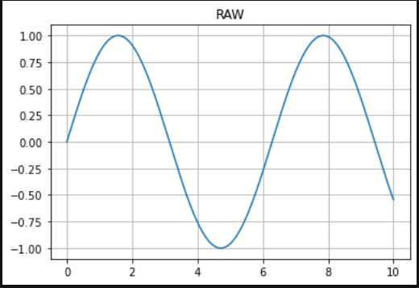
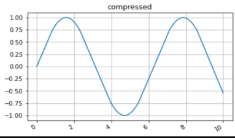

# plot-point-reduction
when we plot a graph the actual pointes required to plot the graph is much lower
we can reduce it without compramising the shape of the graph
## before compression

## after compression

